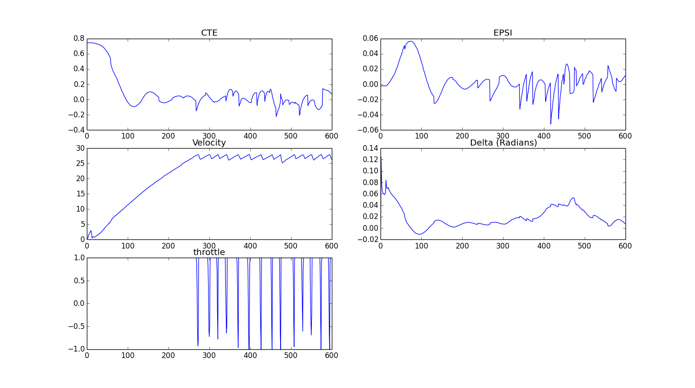
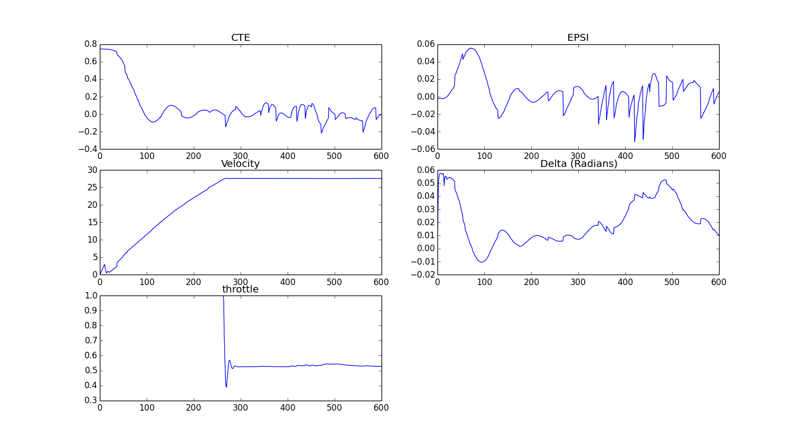
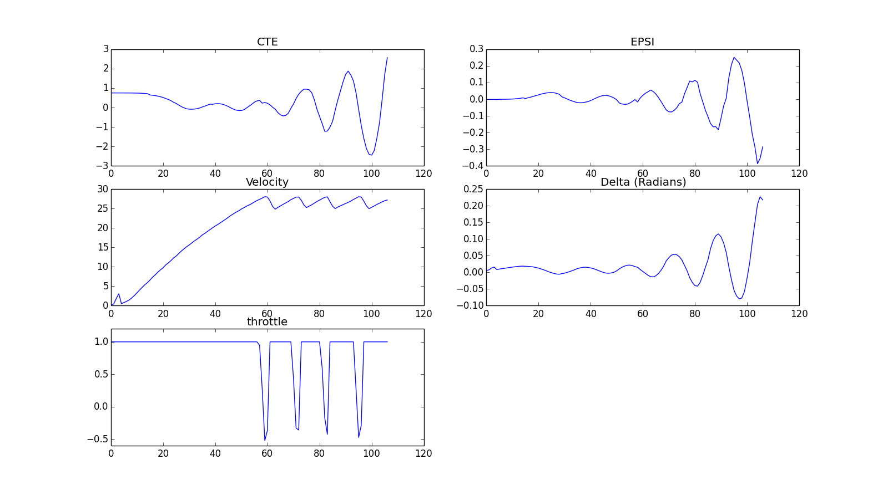

# Reflections on MPC project

In this document, procedure followed during the implementationo of MPC project will be discussed.

## General Outline

The model used in the project was the kinematic model described in Udacity Self-Driving Nanodegree Model Predictive Control Lectures. The states are x & y positions of the car, heading, velocity, and states representing the cross track error and heading error. 

The control inputs are steering angle and aceleration, which are also the variables to be optimized in order to follow the waypoints with minimal error predicted by the model.

Before using the current state in optimization solution, the states x, y, and psi were transformed from global coordinates to vehicle coordinates. 

First, solution without taking delay into account was considered. The main idea is to tune the weights of components of cost function, so that the car drives smoothly while keeping close to desired track. However, in order to do this, one must first choose the horizon for the mpc controller, which are depicted by __dt__, the period and __N__, number of periods for the model to be run for optimization.

As a first value, __dt = 0.1s__ was selected, which makes sense, as the control delay for the system is also 0.1s. __N was selected as 10__, which gives us a 1 second horizon, which means around 27.8m horizon length for a car going at 100kmph. So we are predicting the car behavior with our model for next ~28ms, and using the first control input resulting in optimal behavior (i.e. minimal cte and heading error, in accordance with optimal smooth steering and acceleration control depicted by our cost function) as the control input for the next step. The tuning was first done without taking latency into account. The change made for delayed response will later be explained in this document.

Initial iterations were conducted by using penalties on cte, epsi, speed error, acceleration and steer magnitudes and jerks. However, response was always unstable, because the car was not slowing down before/during curves, and getting off track. One solution to remedy this is to incorporate an additional cost term, w * steer. The tuning process is desribed below.

The iterations for cost function weights are described in the table below. 

__Iteration 1:__ The initial response is extremely erratic, in a few seconds amplitude of oscillations increase and the car goes off the track.

__Iteration 2:__ Increasing penalty for steering input and derivative of steering input by a factor of 5. However, the erratic behaviour continues.

__Iteration 3:__ Increasing the steering related penalties more, and also increasing penalty for epsi. THe erratic behavior didn't change. Increased speed results in inability to follow the path. Will multiply cte and epsi by a factor of 10 in next iteration.

__Iteration 4:__ cte and epsi penalties multiplied by 10.

| #iteration   | w_cte |  w_epsi | w_v | w_steer | w_acc | w_steerjump | w_accjump |
|--------------|:-----:|--------:|----:|--------:|------:|------------:|----------:|
| 1 		   |  1    | 1       | 1   |  0      |  0    |  0          |  0        |
| 2 		   |  100  | 100     | 100 |  5      |  1    |  5          |  1        |
| 3 		   |  100  | 500     | 100 |  10     |  1    |  10         |  1        |
| 4 		   |  1000 | 5000    | 100 |  10     |  1    |  10         |  1        |

At this point, it was found out that no matter what the scaling between the cte and epsi weights vs. the weights for "smoothing", the car was getting off track due to unstable response. This is due to the combination of high velocity and steering angle. For this, a new cost term which is the power of velocity times steering angle was introduced. Not so surprisingly, this resulted in stable response:

| #iteration   | w_cte |  w_epsi | w_v | w_steer | w_acc | w_steerjump | w_accjump | w_steer_times_v |
|--------------|:-----:|--------:|----:|--------:|------:|------------:|----------:|----------------:|
| 5 		   |  1    | 1       | 1   |  0      |  0    |  0          |  0        |   1			|

Below are the figures for iterations 5-6, plotted for first 600 simulation steps.

Figure 1 - response in iteration 5

One can observe the on-off behaviour of throttle, and sudden jumps in control input delta. This can be solved by increasing w_steerjump and w_accjump and thus penalizing sudden jumps in controls:

| #iteration   | w_cte |  w_epsi | w_v | w_steer | w_acc | w_steerjump | w_accjump | w_steer_times_v |
|--------------|:-----:|--------:|----:|--------:|------:|------------:|----------:|----------------:|
| 6 		   |  1    | 1       | 1   |  0      |  0    |  1000         |  1         |   1			|

Figure 2 - response in iteration 6

One can observe that the target waypoints are tracked with maximum cte of 20cm, after initial 60cm error. One can also observe that absolute value of heading error epsi is below 0.06rad = 3.4deg. The car completes the track with high speed and smooth driving.

## Dealing with latency

Above tuning process was done by removing the latency from the simulator. When latency is introduced, the MPC is not able to cope, and the car is gone off-track at around 100th simulation step. The latency shall be taken into account to solve this issue.

Figure 3 - response due to latency

For dealing with the latency, model is run for 1 step with dt=0.1s, and the resulting state is used as the initial state for the optimization.
However, after incorporating latency into the solution, the response was not as desired, and a similar tuning process described above was performed. The final values for the weights are chosen as:

| #iteration   | w_cte |  w_epsi | w_v | w_steer | w_acc | w_steerjump | w_accjump | w_steer_times_v |
|--------------|:-----:|--------:|----:|--------:|------:|------------:|----------:|----------------:|
| FINAL 	   |  10    | 1000   | 1   |  10     |  5    |  1000       |  1        |   30			|

The car can finish the track without going out of road boundaries, and with a somewhat smooth ride. In the curves, cte increases, because the target speed is 100kmph, the car is having a sporty ride.

One further point to investigate might be that the green line (predicted path from MPC) usually points out of the track, however since receding horizon is used and only first control inputs from the prediction are used, the control results in a smooth ride.
